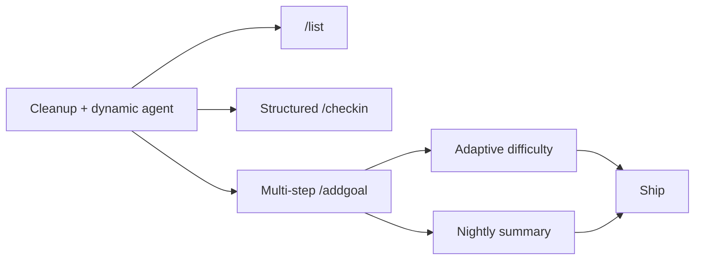

# Bot Feature Enhancements (v2)

## Architecture Shift: Fully Dynamic Agents

**Core change:** Remove all pre-built agent templates (`fitness.py`, `sleep.py`, `money.py`, `social.py`, `short_lived.py`). Replace with a single `DynamicAgent` that gets its behavior entirely from goal-level configuration: `agent_name`, `personality`, `priority`, and `config`.

Every goal -- whether sleep, gym, leetcode, CUDA, or "finish thesis by Friday" -- runs through the same `DynamicAgent` class. The agent's system prompt is constructed at runtime from the goal's stored metadata.

### Why this works

The current 5 agent files are nearly identical. They all:

1. Load logs, cross-context, and peer states
2. Build a prompt with goal-specific config values
3. Call `llm_assess` and return `AgentResult`

The only real differences are the system prompt text and the config fields they read. A single dynamic agent can do all of this by reading `goal.config` and `goal.personality` at runtime.

---

## Data Model Changes

### Migration: [005_dynamic_agents.sql](supabase/migrations/005_dynamic_agents.sql)

```sql
ALTER TABLE goals ADD COLUMN agent_name text NOT NULL DEFAULT 'Goal';
ALTER TABLE goals ADD COLUMN personality text NOT NULL DEFAULT 'warm';
ALTER TABLE goals ADD COLUMN priority text NOT NULL DEFAULT 'normal';

-- Backfill existing goals
UPDATE goals SET agent_name = 'Sleep' WHERE agent_template = 'sleep';
UPDATE goals SET agent_name = 'Fitness' WHERE agent_template = 'fitness';
UPDATE goals SET agent_name = 'Budget' WHERE agent_template = 'money';
UPDATE goals SET agent_name = 'Social' WHERE agent_template = 'social';
UPDATE goals SET priority = 'critical' WHERE type = 'short_lived';
```

New columns on `goals`:

- `agent_name` (text) -- LLM-generated display name: "Leetcode", "CUDA", "Sleep", "Gym". Used as the message header and the identity the user sees.
- `personality` (text) -- One of: `"warm"` | `"strict"`. Controls the agent's tone in all LLM prompts.
  - `warm`: encouraging, celebrates small wins, gentle nudges. For new/first-attempt goals.
  - `strict`: no-nonsense, high intensity, calls out missed days directly. For goals the user has failed at before.
- `priority` (text) -- One of: `"normal"` | `"high"` | `"critical"`.
  - `normal`: default for habits.
  - `high`: user said they've failed before and need to be serious.
  - `critical`: goal has a deadline (auto-set when `end_at` is present). **Always wins in coordinator tiebreaks.**

### Config jsonb additions (no migration, it's jsonb)

```json
{
  "nudge_schedule": "0 9 * * *",
  "logcheck_schedule": "0 22 * * *",
  "domain_topics": ["leetcode", "competitive programming", "algorithms"],
  "target_count": 10,
  "target_unit": "problems"
}
```

- `nudge_schedule` / `logcheck_schedule`: cron expressions for per-goal reminders (Feature 3).
- `domain_topics`: LLM-generated list of 2-3 search terms for Exa content. Replaces the hardcoded `DOMAIN_TOPICS` dict in `exa_client.py`.
- `target_count` (optional, number or null): quantifiable daily/weekly target. Present for goals like "10 leetcode problems" or "run 5K 3x/week". Absent for goals like "take vitamins daily" or "meditate". When present, this is a primary input for the LLM to decide encouragement, pacing, and adaptive difficulty.
- `target_unit` (optional, string or null): human-readable unit for the target ("problems", "km", "hours", "pages"). Only present when `target_count` is present.

---

## Cleanup: No emojis + remove /status

Cross-cutting. Applied to every file.

- [coordinator.py](backend/modal_app/coordinator.py):
  - Replace `AGENT_PERSONAS` with a minimal `COORDINATOR_PERSONA` dict (just hackbitz). Agent display names come from `goal.agent_name`.
  - Delete `handle_status_command` and `ACTION_TO_STATUS`.
  - Remove `/status` from `HELP_TEXT`.
  - Strip all emojis from every hardcoded string, f-string, and template.
  - Add "Do not include any emojis in your response." to every LLM system prompt.
- [app.py](backend/modal_app/app.py): Remove `/status` route from `telegram_webhook`. Remove its import.
- [exa_client.py](backend/shared/exa_client.py): Strip emojis from `CONTENT_FLAVORS` labels (e.g. `"Read"` not `"📖 *Read*"`).
- All LLM prompts everywhere: add the no-emoji instruction.

---

## Agent Architecture: Single DynamicAgent

### Delete these files

- `backend/modal_app/agents/fitness.py`
- `backend/modal_app/agents/sleep.py`
- `backend/modal_app/agents/money.py`
- `backend/modal_app/agents/social.py`
- `backend/modal_app/agents/short_lived.py`

### New file: [backend/modal_app/agents/dynamic.py](backend/modal_app/agents/dynamic.py)

Single agent class that builds its prompt from goal metadata:

```python
class DynamicAgent(BaseAgent):
    template_name = "dynamic"

    def analyze(self, user_id, goal_id, config, goal_meta):
        # goal_meta = {agent_name, personality, priority, name, end_at}
        system_prompt = self._build_system_prompt(goal_meta, config)
        # ... same flow as current agents: logs, cross-context, peers, llm_assess
```

**System prompt construction** -- the key part:

```python
def _build_system_prompt(self, goal_meta, config):
    name = goal_meta["agent_name"]
    personality = goal_meta["personality"]
    priority = goal_meta["priority"]
    goal_name = goal_meta["name"]

    # Base identity
    prompt = f"You are {name}, an accountability partner tracking the goal: {goal_name}.\n"

    # Personality
    if personality == "strict":
        prompt += (
            "You are strict and high intensity. The user has tried this before and failed. "
            "Do not sugarcoat. Call out missed days directly. Push them to their limits. "
            "Be blunt but not cruel. No empty encouragement -- only earned praise.\n"
        )
    else:  # warm
        prompt += (
            "You are warm and encouraging. This may be new territory for the user. "
            "Celebrate small wins. Be gentle with misses. Nudge, don't push. "
            "Make them feel supported, not judged.\n"
        )

    # Priority awareness
    if priority == "critical":
        prompt += (
            "This goal has a hard deadline and is the user's highest priority. "
            "Other goals should yield to this one. Be urgent but not panicked.\n"
        )
    elif priority == "high":
        prompt += (
            "This is a high-priority goal the user is serious about. "
            "Give it more weight than normal goals in your assessment.\n"
        )

    # Deadline
    end_at = goal_meta.get("end_at")
    if end_at:
        # Calculate days remaining, add to prompt
        ...

    # Quantifiable target (optional)
    target_count = config.get("target_count")
    target_unit = config.get("target_unit", "")
    if target_count is not None:
        prompt += (
            f"\nThis goal has a measurable target: {target_count} {target_unit} per period. "
            "Use this number as a key decision-maker. Compare the user's actual output "
            "against this target to decide whether to encourage, push harder, or suggest "
            "scaling back. If they consistently hit ~50% of target, suggest adjusting down. "
            "If they consistently exceed the target, suggest increasing it.\n"
        )
    else:
        prompt += (
            "\nThis goal is not quantifiable (e.g. a daily habit like taking vitamins). "
            "Track it as done/not-done based on whether the user logged it. "
            "Do not suggest numeric adjustments. Focus on consistency and streaks.\n"
        )

    # Standard output format
    prompt += (
        "\nReturn JSON with:\n"
        "- status: \"monitoring\" | \"concerned\" | \"intervention_needed\"\n"
        "- next_action: \"monitor\" | \"nudge\" | \"call\" | \"escalate\"\n"
        "- reasoning: brief explanation\n"
        "- confidence: 0.0-1.0\n"
        "- message_to_user: optional message (null if monitoring)\n"
    )
    if target_count is not None:
        prompt += (
            "- goal_adjustment: optional {\"direction\": \"easier\"|\"harder\", "
            "\"suggestion\": \"...\", \"new_config\": {...}} or null "
            "(only when the target clearly needs adjusting based on sustained pattern)\n"
        )
    else:
        prompt += "- goal_adjustment: null (not applicable for non-quantifiable goals)\n"
    prompt += "Do not include any emojis.\n"
    return prompt
```

### Changes to [base.py](backend/modal_app/agents/base.py)

- `analyze()` signature changes to accept `goal_meta: dict` alongside `config`.
- Add `goal_adjustment` field to `AgentResult` (for Feature 4).

### Changes to [app.py](backend/modal_app/app.py)

- Replace `AGENT_REGISTRY` dict with a direct import of `DynamicAgent`.
- `run_agent_for_goal` passes `goal_meta` (agent_name, personality, priority, name, end_at) to `agent.analyze()`.
- Remove `_import_agent` helper.

---

## Coordinator Priority Engine

The coordinator's decision-making needs to understand dynamic priorities. This replaces the hardcoded `TEMPLATE_PRIORITY` list.

### New priority resolution in [coordinator.py](backend/modal_app/coordinator.py)

Replace `TEMPLATE_PRIORITY = ["sleep", "fitness", ...]` with a function:

```python
PRIORITY_ORDER = {"critical": 0, "high": 1, "normal": 2}

def _sort_by_priority(agent_states: list[dict]) -> list[dict]:
    """Sort agent states by goal priority (critical first), then by severity."""
    SEVERITY = {"escalate": 0, "call": 1, "nudge": 2, "monitor": 3}
    def key(s):
        goal = s.get("goals") or {}
        priority = goal.get("priority", "normal")
        action = (s.get("state") or {}).get("next_action", "monitor")
        return (PRIORITY_ORDER.get(priority, 2), SEVERITY.get(action, 3))
    return sorted(agent_states, key=key)
```

### How this changes coordinator behavior

- `**_handle_pattern_check**`: When multiple agents are concerned, the coordinator picks the highest-*priority* goal (not hardcoded sleep-first). A critical deadline goal always wins over a normal habit.
- `**_handle_checkin`**: Goals sorted by priority in the output.
- `**_handle_reactive_log`**: If the user logs to a normal goal but has a critical goal in escalate state, hackbitz can add a gentle reminder about the critical goal.
- **Nightly summary**: Critical goals appear first, with the coordinator explicitly deprioritizing normal goals when critical ones need attention.

### Cross-agent coordination logic

The peer-state awareness already exists in `get_peer_states()`. The key change is that **priority is now a first-class field** in the states summary:

```python
# In BaseAgent.get_peer_states(), include priority:
summary = f"- {agent_name} ({goal_name}): {next_action}, priority={priority}"
```

This means every agent naturally sees "CUDA (Learn CUDA basics): monitor, priority=normal" and "Thesis (Finish thesis): escalate, priority=critical" and can self-regulate. A strict agent tracking gym will see the critical thesis and ease off.

---

## Feature 1: /list command

- [coordinator.py](backend/modal_app/coordinator.py): Add `handle_list_command(user_id)`.
- Reads `get_active_goals(user_id)`, joins with `get_agent_states_for_user(user_id)`.
- Format:

```
*hackbitz*

Your goals:
1. Leetcode -- 10 problems daily -- on track
2. Sleep -- Sleep 7h/night -- watch this [high]
3. Thesis -- Finish by March 5 -- needs attention [critical]
4. CUDA -- Learn CUDA basics -- just started
```

- Status labels: "on track", "watch this", "needs attention", "off track".
- Priority shown in brackets only for high/critical goals.
- Goals with no `agent_states` entry show "just started".
- [app.py](backend/modal_app/app.py): Add `/list` route. Update `HELP_TEXT`.

---

## Feature 2: Structured /checkin output

Same as before, but using `agent_name` and `priority`:

- [coordinator.py](backend/modal_app/coordinator.py) -- rewrite `_handle_checkin`.
- LLM prompt asks for structured JSON per goal (name, status, one_liner, streak_days, streak_label).
- Build Telegram message from JSON. Group into "Going well" / "Needs attention". Show streaks.
- Goals sorted by priority (critical first).
- Append `top_priority` as "hackbitz says:" section.
- Exa links for top concern, using `goal.config.domain_topics` instead of hardcoded `DOMAIN_TOPICS`.

---

## Feature 3: Multi-step /addgoal with personality questionnaire

### The full flow on Telegram

```
User: /addgoal Do 10 leetcode problems daily

Bot:  Got it -- I've added "Daily Leetcode Practice".
      Everything related to this will be tracked by *Leetcode*.
      Have you tried following this goal before?
      [New to this -- first time]  [Tried before, need to get serious]

User: [Tried before, need to get serious]

Bot:  Understood -- I'll be direct with you on this one.
      When should I nudge you about this?
      [Every morning 9am]  [Every evening 7pm]  [Custom]

User: [Every morning 9am]

Bot:  And when should I check if you logged progress?
      [Daily 10pm]  [Daily 8pm]  [Custom]

User: [Daily 10pm]

Bot:  All set! Leetcode will remind you at 9am and check in at 10pm.
      No going easy on you.
```

### Deadline goals skip the questionnaire

If the LLM detects a deadline in the description (e.g. "finish thesis by Friday", "exam in 3 days"), the goal is auto-set to:

- `personality = "strict"` (deadlines demand urgency)
- `priority = "critical"` (always wins tiebreaks)
- Skip the "have you tried before" question -- go straight to nudge/logcheck schedule.

The LLM prompt in `_parse_and_create_goal` is updated to detect this:

```json
{
  "name": "Finish Thesis",
  "agent_name": "Thesis",
  "has_deadline": true,
  "end_at": "2026-03-05T00:00:00+00:00",
  "personality": "strict",
  "priority": "critical",
  "config": {
    "success_criteria": "Submit thesis draft",
    "domain_topics": ["thesis writing", "academic productivity"],
    "target_count": null,
    "target_unit": null
  }
}
```

For a quantifiable goal like "10 leetcode problems daily":

```json
{
  "name": "Daily Leetcode Practice",
  "agent_name": "Leetcode",
  "has_deadline": false,
  "end_at": null,
  "config": {
    "frequency_per_week": 7,
    "target_count": 10,
    "target_unit": "problems",
    "domain_topics": ["leetcode", "competitive programming", "algorithms"]
  }
}
```

For a non-quantifiable habit like "take vitamins daily":

```json
{
  "name": "Daily Vitamins",
  "agent_name": "Vitamins",
  "has_deadline": false,
  "end_at": null,
  "config": {
    "frequency_per_week": 7,
    "target_count": null,
    "target_unit": null,
    "domain_topics": ["supplements", "daily health habits"]
  }
}
```

The LLM prompt for `_parse_and_create_goal` explicitly instructs: "If the goal has a measurable numeric target (e.g. '10 problems', '5K run', '8 hours sleep'), extract target_count and target_unit. If it's a binary done/not-done habit (e.g. 'take vitamins', 'meditate', 'journal'), set both to null."

### Callback data encoding

Multi-step inline buttons use prefixed callback data:

- `addgoal:exp:<goal_id>:new` -- user is new to this goal
- `addgoal:exp:<goal_id>:failed` -- user has failed before
- `addgoal:nudge:<goal_id>:9am` -- nudge at 9am
- `addgoal:nudge:<goal_id>:7pm` -- nudge at 7pm
- `addgoal:nudge:<goal_id>:custom` -- user wants custom time (bot asks for freetext)
- `addgoal:logcheck:<goal_id>:10pm` -- logcheck at 10pm
- `addgoal:logcheck:<goal_id>:8pm` -- logcheck at 8pm
- `addgoal:logcheck:<goal_id>:custom` -- custom

On experience callback:

- `new` -> `personality = "warm"`, `priority = "normal"`
- `failed` -> `personality = "strict"`, `priority = "high"`
- Update goal row in Supabase.

On nudge/logcheck callbacks:

- Map button labels to cron expressions: `"9am" -> "0 9 * * *"`, `"7pm" -> "0 19 * * *"`, etc.
- Update `goals.config` with `nudge_schedule` / `logcheck_schedule`.

### `scheduled_nudge_tick()` -- new Modal cron

- [app.py](backend/modal_app/app.py): New Modal cron function, `*/5 * * * *`.
- Loads all active goals for all users.
- Groups by `user_id`.
- For each goal with `nudge_schedule` or `logcheck_schedule` in its config:
  - Use `croniter` to check: "should this cron have fired in the last 5 minutes?"
  - **Nudge**: Send a short motivational message via the goal's `agent_name`, styled by `personality`.
  - **Log-check**: Query `get_recent_logs(user_id, goal_id, days=1)`. If no logs today, send "How did it go with {goal_name} today? Log your progress."
  - Message tone matches `personality` (warm vs strict).
- Add `croniter` to Modal image pip_install.

### Changes

- [coordinator.py](backend/modal_app/coordinator.py):
  - Rewrite `_parse_and_create_goal` LLM prompt to return `agent_name`, `has_deadline`, `domain_topics`.
  - Rewrite `handle_addgoal_command` to create goal, then send experience question (or skip for deadline goals).
  - Add `_generate_nudge_message(goal, user_id, llm_fn)` and `_generate_logcheck_message(goal, user_id)`.
- [app.py](backend/modal_app/app.py):
  - Add callback routing for `addgoal:exp:`*, `addgoal:nudge:`*, `addgoal:logcheck:*`.
  - Add `scheduled_nudge_tick()`.
- [supabase_client.py](backend/shared/supabase_client.py):
  - Add `update_goal_meta(goal_id, fields: dict)` -- updates any combination of `personality`, `priority`, `config`, `agent_name`.

---

## Feature 4: Adaptive goal difficulty

**Only applies to goals with `target_count` in their config.** Non-quantifiable goals (vitamins, meditate, journal) never get adjustment suggestions -- the agent prompt already says `goal_adjustment: null` for those.

- `DynamicAgent` system prompt conditionally includes the adjustment instruction (already shown above).
- `AgentResult` gets `goal_adjustment: dict | None`.
- The coordinator checks agent states after each tick. If `goal_adjustment` is present in the state, send an inline-button message:

```
*Leetcode*

You've been doing about 5 problems a day -- that's solid progress.
Want to adjust the goal to 6/day? You can always bump it up later.

[Yes, adjust to 6/day]  [Keep it at 10/day]
```

- On confirm callback (`adjust:yes:<goal_id>`): update `goals.config` with `new_config` (including the new `target_count`).
- On skip callback (`adjust:no:<goal_id>`): no change, just ack.
- Store `goal_adjustment` in `agent_states.state` so the coordinator can read it without re-running the agent.
- The adjustment `new_config` always includes the updated `target_count` and `target_unit` so the next agent run uses the new target.

### Changes

- [agents/base.py](backend/modal_app/agents/base.py): Add `goal_adjustment` to `AgentResult` and `to_state()`.
- [agents/dynamic.py](backend/modal_app/agents/dynamic.py): Adjustment instruction in system prompt.
- [coordinator.py](backend/modal_app/coordinator.py): Check for adjustments in `_handle_pattern_check`.
- [app.py](backend/modal_app/app.py): Callback handlers for `adjust:yes:*` and `adjust:no:*`.
- [supabase_client.py](backend/shared/supabase_client.py): `update_goal_config(goal_id, config)`.

---

## Feature 5: Coordinated nightly summary

- Piggybacks on `scheduled_nudge_tick()`.
- Nightly summary time: derived from the user's sleep-related goal `target_bedtime` if one exists, otherwise defaults to 10pm (22:00). Stored nowhere extra -- computed at runtime from the user's goals.
- The `scheduled_nudge_tick()` checks: "is it nightly summary time (within 5-minute window) for this user?"
- If yes:
  1. Load all agent states.
  2. Sort by priority (critical first).
  3. Build a structured LLM prompt asking for 1-line scorecard per goal + "tomorrow's focus".
  4. The LLM sees all priorities and personalities. If a strict high-priority gym agent is escalating but a critical thesis is due, the summary says "skip the gym, focus on the thesis."
  5. Send ONE message from hackbitz.

Format:

```
*hackbitz -- Evening wrap-up*

Today's scorecard:
- Thesis [critical]: No progress logged -- you said Friday is the deadline, this can't wait
- Leetcode: Solved 4 problems, solid day
- Fitness: Skipping today is fine -- thesis comes first
- Sleep: On track

Tomorrow's focus: Thesis. Everything else takes a back seat until Friday.
```

- Counts as an intervention (dedup: suppresses proactive pattern messages within 6h).
- **This is the cross-agent coordination demo**: the summary explicitly shows the coordinator overriding individual agents based on priority.

### Changes

- [coordinator.py](backend/modal_app/coordinator.py): Add `_handle_nightly_summary(user_id, llm_fn)`.
- [app.py](backend/modal_app/app.py): Nightly summary check in `scheduled_nudge_tick()`.

---

## Exa Client Changes

- [exa_client.py](backend/shared/exa_client.py):
  - Remove hardcoded `DOMAIN_TOPICS` dict.
  - `search_content_multi` accepts `topics: list[str]` parameter directly (from `goal.config.domain_topics`).
  - Fallback: if goal has no `domain_topics`, use `[goal_name]` as the topic.
  - Strip emojis from `CONTENT_FLAVORS` labels.
  - Remove `TEMPLATE_FLAVOR_SETS` (no templates anymore). Flavors are picked randomly or round-robin from `ALL_FLAVORS`.

---

## Implementation Order




1. **Cleanup + Dynamic Agent** (f0): Migration, delete 5 template files, create `dynamic.py`, update `base.py`, update `app.py` registry, update `coordinator.py` to use `agent_name`/`priority`/`personality`, strip emojis, remove `/status`.
2. **Feature 1** (f1) and **Feature 2** (f2): Independent, can be done in parallel after f0.
3. **Feature 3** (f3): Multi-step addgoal + `scheduled_nudge_tick` cron.
4. **Features 4 and 5** (f4, f5): Depend on f3's cron and f0's dynamic agent. Can be done in parallel.

---

## Files touched (summary)

- `supabase/migrations/005_dynamic_agents.sql` -- new columns (agent_name, personality, priority)
- `backend/modal_app/agents/dynamic.py` -- **new file**, replaces all 5 template agents
- `backend/modal_app/agents/base.py` -- goal_adjustment in AgentResult, analyze() signature
- `backend/modal_app/agents/fitness.py` -- **delete**
- `backend/modal_app/agents/sleep.py` -- **delete**
- `backend/modal_app/agents/money.py` -- **delete**
- `backend/modal_app/agents/social.py` -- **delete**
- `backend/modal_app/agents/short_lived.py` -- **delete**
- `backend/modal_app/coordinator.py` -- all features (priority engine, dynamic names, new commands, nightly summary)
- `backend/modal_app/app.py` -- all features (new callbacks, new cron, remove registry, remove /status)
- `backend/shared/supabase_client.py` -- create_goal with agent_name/personality/priority, update_goal_meta, update_goal_config
- `backend/shared/exa_client.py` -- remove DOMAIN_TOPICS, accept topics param, strip emojis
- Modal image: add `croniter` dependency

